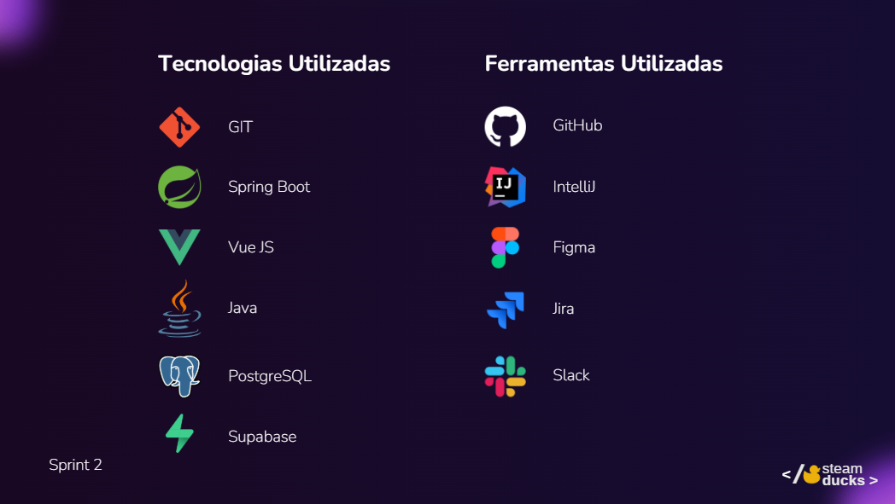

# Rafaella Letícia Rodrigues Cruz

## Introdução

    Olá, meu nome é <b>Rafaella</b>, tenho 26 anos, atualmente estou cursando o 4º semestre de Banco de Dados na <b>Fatec São José dos Campos</b>, onde todos os semestres trabalhamos com a metodologia SCRUM, desenvolvendo soluções para empresas reais, a fim de aplicar os conhecimentos adquiridos durante o semestre, incluindo a aplicação das funções de desenvolvedores, Product Owner e Scrum Masters. 
    Também sou técnica em Administração pelo <b>CEPHAS</b> e Desenvolvedora WEB Full-Stack Júnior pelo bootcamp de tecnologia da <b>Generation Brazil</b>.

## Contatos
* [GitHub](https://www.git.com/arafaellacruz)
* [LinkedIn](https://www.linkedin.com/in/cruz-rafaella/)

## Meus Principais Conhecimentos

Sou desenvolvedora full-stack em formação, apaixonada por tecnologia e inovação. Tenho experiência com HTML, CSS, JavaScript, TypeScript, React, Java, Spring, Python e MySQL. Já atuei como desenvolvedora, PO e Scrum Master em projetos colaborativos, sempre buscando soluções criativas e funcionais. 💻🚀

## Meus Projetos

### Em 2025-1

O projeto trata-se de um "Sistema de Ponto" neste repositório. O objetivo do projeto é criar uma aplicação web que permita o monitoramento de funcionários de empresas terceiras em uma determinada área de manutenção. O projeto inclui a modelagem de um banco de dados relacional e desenvolvimento de API. Por meio deste projeto, buscamos solidificar nossos conhecimentos em modelagem de dados e desenvolvimento de software.

[GitHub - Pontual. (Point System)](https://github.com/Steam-Ducks/point-system)

#### Tecnologias Utilizadas

#### Contribuições Pessoais

Contribuí inicialmente com a construção da identidade visual e a prototipação da solução utilizando o Figma. Ao longo da 2ª e 3ª sprint, direcionei meus esforços para o desenvolvimento frontend e, principalmente, para o backend, com foco na funcionalidade de histórico de pontos.

<ul>
  <li><strong>Identidade visual (Canva)</strong>: Na 1ª sprint, definimos a paleta de cores e a identidade visual do projeto, criando uma base sólida para o desenvolvimento.</li>
  
  <li><strong>Prototipação (Figma)</strong>: Aceitei o desafio de aprender a criar telas e fluxos no Figma, transformando a identidade visual em protótipos funcionais para guiar o restante do projeto.</li>

  <li><strong>Componentes iniciais com Vue.js</strong>: Ainda na 1ª sprint decidimos entregar 2 telas, então focamos no desenvolvimento dos componentes base. Atuei estilizando e criando componentes na parte da sidebar e também header./li>
  <li><strong>Criação de entidades no Supase</strong>: Com um banco baseado em PostgreSQL desenvolvi algumas entidades para uso do nosso backend, citando mais importantes os registros de pontos e histórico de alterações do mesmo.</li>
    <li><strong>Desenvolvimento backend com Spring Boot</strong>: Com um banco baseado em PostgreSQL desenvolvi algumas entidades para uso do nosso backend, citando mais importantes os registros de pontos e histórico de alterações do mesmo.</li>
</ul>

#### Hard Skills - maximo que eu conseguir

Destaco minha atuação no desenvolvimento das ferramentas de prototipação do projeto, na implementação do frontend com Vue.js e no backend com Spring Boot. Além disso, trabalhei com o banco de dados em nuvem utilizando Supabase, integrando as tecnologias de forma eficiente e coesa.

#### Soft Skills

Além das habilidades técnicas, destaco minhas soft skills, como comunicação clara, colaboração em equipe, adaptabilidade e proatividade. Essas competências me permitem lidar com desafios de forma eficiente, contribuir para um ambiente de trabalho harmonioso e impulsionar resultados de maneira criativa e estratégica.

### Em 2022-1
Mesmo formato

### Em 2022-2
Mesmo formato

### Em 2023-1
Mesmo formato

### Em 2023-2
Mesmo formato

