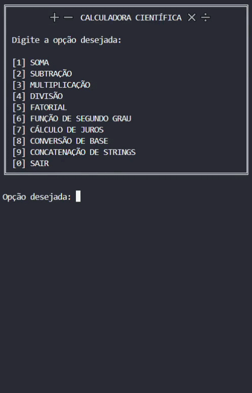
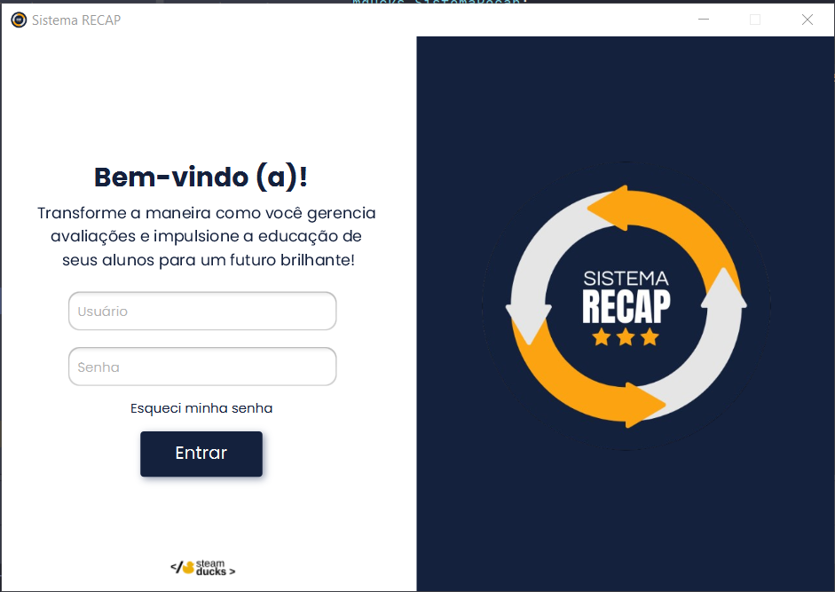
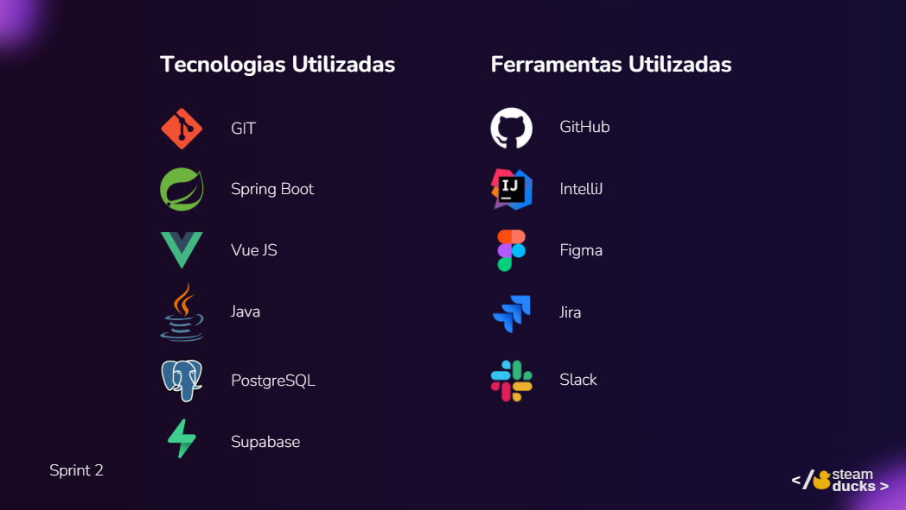
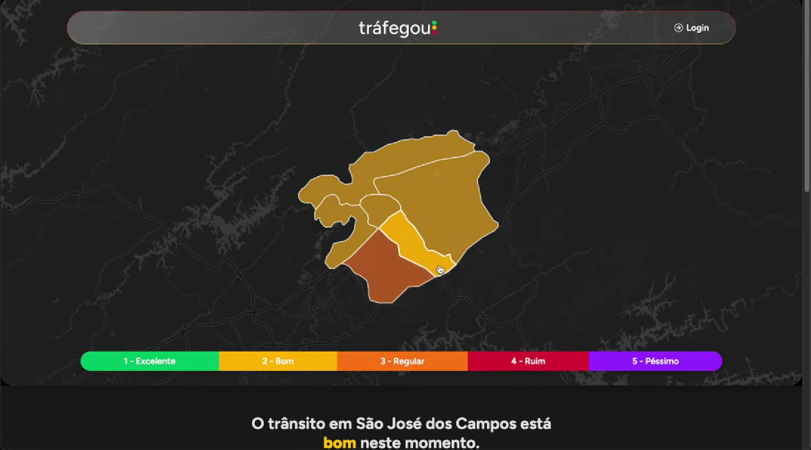

  Trabalho de Graduação na modalidade Portfólio das Aprendizagens a partir de Projeto Integrador (APIs), apresentado à Faculdade de Tecnologia de São José dos Campos, como parte dos requisitos necessários para a obtenção do título de Tecnólogo em Banco de Dados.

---

## Sumário

◻️ [Sobre mim](#sobre-mim)

◻️ [Meus Projetos](#meus-projetos)

◻️ [1º Semestre • 1/2024 • Calculadora Científica](#semestre-1)

◻️ [2º Semestre • 2/2024 • PACER Assessment System](#semestre-2)

◻️ [3º Semestre • 1/2025 • Pontual - Sistema de Ponto](#semestre-3)

◻️ [4º Semestre • 2/2025 • Tráfegou! - Monitoramento de Tráfego Inteligente](#semestre-4)

---

## Sobre mim

Olá! Sou a <b>Rafaella</b>, tenho 27 anos e sou de São José dos Campos. Sou curiosa por natureza e movida por desafios — e essa característica aparece tanto na forma como eu codifico quanto na minha vida fora da tela. Gosto muito de esportes, surf, praia e de viajar sempre que possível. Estar perto do mar me dá a sensação de que qualquer problema tem solução, e explorar lugares novos me ajuda a enxergar o mundo com perspectivas diferentes, algo que acaba influenciando também a forma como penso e resolvo problemas no trabalho.

Na área profissional, estou cursando o <b>5º semestre de Banco de Dados na Fatec São José dos Campos</b>, onde cada semestre desenvolvemos projetos reais para empresas parceiras utilizando a metodologia SCRUM. Sou técnica em Administração pelo <b>CEPHAS</b> e Desenvolvedora WEB Full-Stack Júnior formada pelo bootcamp de tecnologia da <b>Generation Brazil</b>. Ao longo da graduação, atuei como desenvolvedora, Product Owner e Scrum Master, construindo sistemas que evoluíram desde aplicações em terminal até arquiteturas web full stack com Vue.js, Java Spring Boot, TypeScript e PostgreSQL.

  
  

---

## Meus Projetos

<!-- ============================================================ -->
<!-- 1º Semestre                                                   -->
<!-- ============================================================ -->

  <h1>1º Semestre • 1/2024</h1>

  <h3><a href="https://github.com/Steam-Ducks/scientific-calculator/tree/main" target="_blank">Calculadora Científica</a></h3>
  
<i>Aplicação em terminal desenvolvida para executar operações matemáticas, conversões numéricas e validações de entrada, evoluindo de VisualG para TypeScript ao longo das sprints.</i>

  

  

    
  

  
Detalhes do Projeto

  

    No primeiro semestre de 2024, desenvolvemos a <b>Calculadora Científica</b>, uma aplicação em terminal criada para executar operações matemáticas, conversões entre bases numéricas e cálculos complementares como juros simples e função de segundo grau. O projeto foi desenvolvido em contexto acadêmico, com foco no aprendizado prático de lógica de programação e organização de software, atendendo a um <b>cliente interno</b> da própria Fatec.
  

  

    O desenvolvimento foi dividido em sprints, com as primeiras entregas realizadas em <b>VisualG</b> para prototipação da lógica, e a evolução posterior para <b>TypeScript</b>. Essa transição representou um desafio importante para o time: além de reescrever as funcionalidades já implementadas, foi necessário adaptar o raciocínio de uma linguagem de pseudocódigo para uma linguagem orientada a tipos, com suporte a modularização real e versionamento em equipe. Aprender a trabalhar com Git e GitHub foi parte essencial desse processo, já que o projeto exigia colaboração simultânea entre os integrantes.
  

  

  ### Tecnologias Utilizadas

  | Tecnologia | Finalidade |
  |---|---|
  | VisualG | Prototipação inicial das operações |
  | TypeScript | Implementação final da aplicação |
  | Git / GitHub | Versionamento e colaboração em equipe |

  

  ### Contribuições Pessoais

  

    
Implementação de operações matemáticas

    

    

      Contribuí na implementação de operações matemáticas básicas e avançadas, incluindo cálculo de juros simples e função de segundo grau (com cálculo do discriminante e tratamento dos casos sem raízes reais). Para cada operação, o cuidado foi garantir que a entrada do usuário fosse tratada corretamente antes de qualquer processamento, evitando resultados inconsistentes ou erros silenciosos. Estruturei as funções de forma isolada para facilitar a integração ao menu principal desenvolvido pelo time, seguindo o padrão modular adotado pelo grupo.
    

  

  

    
Validação de entrada e tratamento de erros

    

    

      Em uma aplicação de terminal, onde toda a interação depende do que o usuário digita, garantir a validação das entradas é fundamental para a robustez do sistema. Trabalhei com verificações de tipo numérico, prevenção de operações matematicamente inválidas (como divisão por zero e raiz quadrada de negativos) e exibição de mensagens de erro objetivas. Cada função validava os dados antes de executar o cálculo, o que reduzia retrabalho causado por entradas inesperadas e tornava o fluxo do terminal mais confiável para o usuário.
    

  

  

    
Padronização e organização do código

    

    

      Com múltiplos integrantes desenvolvendo funcionalidades em paralelo, a consistência do código se tornava um risco real de integração. Contribuí na definição e adoção de convenções de nomenclatura, organização modular das funções e separação de responsabilidades entre os arquivos. Esse cuidado com padronização facilitou o processo de integração das partes ao menu principal, reduziu conflitos durante os merges e tornou o projeto mais legível para qualquer integrante do time, independentemente de quem havia escrito cada trecho.
    

  

  

  ### Hard Skills

  

    
<b>Clique para ver a lista de hard skills</b>

     
    

  | Tecnologia / Metodologia | Classificação |
  |---|---|
  | Lógica de Programação | ★★★★☆☆ |
  | VisualG | ★★★★★☆ |
  | TypeScript | ★★★☆☆☆ |
  | Git / GitHub | ★★★☆☆☆ |
  | Scrum | ★★★☆☆☆ |

    

  

  

  ### Soft Skills

  

    
<b>Clique para ver a lista de soft skills</b>

     
    

  | Habilidade | Classificação |
  |---|---|
  | Trabalho em Equipe | ★★★★☆☆ |
  | Adaptação ao Scrum | ★★★☆☆☆ |
  | Proatividade | ★★★★☆☆ |

  
<b>Trabalho em Equipe:</b> Aprendi a colaborar ativamente com os integrantes do grupo durante a divisão de tarefas e integração das funcionalidades. Como era o primeiro projeto com desenvolvimento em equipe, entender como alinhar contribuições individuais sem gerar conflitos ou retrabalho foi um aprendizado prático constante ao longo das sprints.

  
<b>Adaptação ao Scrum:</b> Tive meu primeiro contato com a metodologia ágil SCRUM, aprendendo a organizar o trabalho em sprints com objetivos e entregas definidas. Essa estrutura tornou o desenvolvimento mais previsível e ajudou o time a manter o foco nas prioridades de cada ciclo.

  
<b>Proatividade:</b> Busquei contribuir além das tarefas que me foram designadas, auxiliando na integração de funcionalidades e colaborando com colegas que encontravam dificuldades em suas entregas. Essa postura ajudou a manter o ritmo do time mesmo quando surgiram imprevistos ao longo das sprints.

  

<a href="#sumário">Voltar para o início</a>

<!-- ============================================================ -->
<!-- 2º Semestre                                                   -->
<!-- ============================================================ -->

  <h1>2º Semestre • 2/2024</h1>

  <h3><a href="https://github.com/Steam-Ducks/pacer-assessment-system" target="_blank">PACER Assessment System</a></h3>
  
<i>Sistema desktop desenvolvido para apoiar a avaliação de integrantes de equipe com base em critérios definidos pelo administrador, incluindo autenticação, gestão de grupos, critérios e relatórios.</i>

  

  

    
  

  
Detalhes do Projeto

  

    No segundo semestre de 2024, desenvolvemos o <b>PACER Assessment System</b>, um sistema desktop criado para tornar o processo de avaliação de integrantes de equipe mais estruturado, transparente e rastreável. O projeto foi construído em contexto acadêmico e contemplava autenticação de usuários, gerenciamento de grupos, definição de critérios de avaliação, cadastro de sprints e geração de relatórios com os resultados individuais de cada integrante.
  

  

    Atuei como <b>desenvolvedora</b>, responsável pela implementação de funcionalidades e pela interface da aplicação. Enquanto o time contava com um Product Owner cuidando da visão e documentação do produto, minha atuação esteve diretamente ligada à construção do sistema: desenvolvimento de telas, lógica de negócio e integração com o banco de dados.
  

  

  ### Tecnologias Utilizadas

  | Tecnologia | Finalidade |
  |---|---|
  | Java | Backend e lógica de negócio |
  | JavaFX | Interface gráfica desktop |
  | MySQL | Banco de dados relacional |
  | Git / GitHub | Versionamento e colaboração em equipe |

  

  ### Contribuições Pessoais

  

    
Desenvolvimento de telas e fluxos da interface

    

    

      Atuei no desenvolvimento das telas da aplicação desktop com JavaFX, implementando a interface de avaliação e os fluxos de navegação entre os módulos do sistema. Trabalhei na construção de formulários para preenchimento das avaliações e na exibição organizada das informações para o usuário. O cuidado com os fluxos de navegação foi importante para garantir que o sistema fosse intuitivo mesmo para avaliadores que o utilizassem pela primeira vez, sem necessidade de treinamento adicional.
    

  

  

    
Implementação da lógica de avaliação

    

    

      Contribuí na implementação das funcionalidades relacionadas ao preenchimento e visualização das avaliações. Isso envolveu a lógica de cálculo de médias ponderadas por critério e a exibição dos resultados individuais de cada integrante de forma clara. Foi necessário garantir que os cálculos refletissem corretamente o peso de cada critério e que os relatórios gerados apresentassem os dados de maneira comparável entre os avaliados, permitindo que professores e líderes tomassem decisões com base em informações confiáveis.
    

  

  

    
Modelagem e integração com banco de dados

    

    

      Participei da modelagem das entidades do sistema e da integração com o banco de dados relacional em MySQL. A modelagem envolveu a definição de tabelas para usuários, grupos, critérios, sprints e avaliações, considerando os relacionamentos entre essas entidades e garantindo integridade referencial. Trabalhei com consultas SQL para leitura e gravação das avaliações e critérios, e me preocupei em construir queries eficientes para que os relatórios fossem gerados sem lentidão mesmo com volumes maiores de dados.
    

  

  

  ### Hard Skills

  

    
<b>Clique para ver a lista de hard skills</b>

     
    

  | Tecnologia / Metodologia | Classificação |
  |---|---|
  | Java | ★★★★☆☆ |
  | JavaFX | ★★★☆☆☆ |
  | MySQL | ★★★★☆☆ |
  | Git / GitHub | ★★★★☆☆ |
  | Scrum - Desenvolvedor | ★★★★☆☆ |

    

  

  

  ### Soft Skills

  

    
<b>Clique para ver a lista de soft skills</b>

     
    

  | Habilidade | Classificação |
  |---|---|
  | Organização | ★★★★☆☆ |
  | Comunicação Técnica | ★★★★☆☆ |
  | Colaboração | ★★★★☆☆ |

    

  
<b>Organização:</b> Com um sistema de maior complexidade do que o do semestre anterior, desenvolvi mais organização para lidar com funcionalidades interligadas e manter clareza sobre o que havia sido feito e o que ainda precisava ser implementado. Essa habilidade foi essencial para cumprir os prazos de cada sprint sem acumular débito técnico.

  
<b>Comunicação Técnica:</b> Aprendi a comunicar dúvidas, decisões técnicas e bloqueios de forma clara para o time. Em um projeto com separação entre Product Owner e desenvolvedores, foi importante traduzir problemas de implementação em linguagem compreensível para quem não estava no código, e vice-versa.

  
<b>Colaboração:</b> Atuei em conjunto com os demais desenvolvedores do time para garantir que as funcionalidades se integrassem corretamente ao final de cada sprint. Quando surgiram divergências de abordagem, o caminho foi alinhar em conjunto ao invés de cada um seguir em direções diferentes.

  

<a href="#sumário">Voltar para o início</a>

<!-- ============================================================ -->
<!-- 3º Semestre                                                   -->
<!-- ============================================================ -->

  <h1>3º Semestre • 1/2025</h1>

  <h3><a href="https://github.com/Steam-Ducks/point-system" target="_blank">Pontual - Sistema de Ponto</a></h3>
  
<i>Aplicação web para monitorar horas trabalhadas de funcionários de empresas terceirizadas, desenvolvida para a empresa Altave.</i>

  

  

    
  

  
Detalhes do Projeto

  

    No terceiro semestre de 2025, desenvolvemos o <b>Pontual</b>, uma aplicação web para monitorar horas trabalhadas de funcionários de empresas terceirizadas. Nosso cliente, a <b>Altave</b>, é uma empresa que atua com coleta de imagens e reconhecimento facial — iniciou suas operações com balões meteorológicos e hoje aplica sua tecnologia em segurança, como em plataformas petrolíferas.
  

  

    O caso apresentado pelo cliente envolvia um estaleiro onde empresas terceiras realizam manutenção em navios. As câmeras da Altave identificam os colaboradores e enviam essas informações ao sistema, que registra os pontos, calcula as horas trabalhadas e gera o valor de salário individualmente. O projeto incluiu a construção de interface para cadastro de empresas e profissionais, filtros de dados, extração de relatórios e dashboards interativos. Um dos desafios foi lidar corretamente com funcionários em escalas noturnas, onde o ponto atravessa a meia-noite, e permitir a edição manual de registros com histórico de alterações rastreável.
  

  

  ### Tecnologias Utilizadas

  

  

  ### Contribuições Pessoais

  

    
Identidade visual e prototipação com Canva e Figma

    

    

      Na 1ª sprint, fui responsável por definir a paleta de cores e a identidade visual do projeto utilizando o Canva. Essa etapa foi importante para estabelecer um padrão visual coerente antes de começar a codificação, garantindo que todas as telas desenvolvidas pelo time seguissem a mesma linguagem de design. Após essa definição, aceitei o desafio de aprender o Figma para transformar a identidade visual em protótipos navegáveis, criando wireframes das telas principais e mapeando os fluxos de navegação. Essa prototipação guiou o desenvolvimento do frontend e antecipou discussões de UX que teriam surgido mais tarde, reduzindo retrabalho nas sprints seguintes.
    

  

  

    
Componentes iniciais com Vue.js

    

    

      Ainda na 1ª sprint, o time decidiu entregar duas telas funcionais como prova de conceito. Assumi o desenvolvimento dos componentes estruturais da interface: a <b>sidebar</b> de navegação e o <b>header</b> da aplicação. Além de estilizar esses elementos, me preocupei em torná-los reutilizáveis para que o restante do time pudesse incorporá-los nas demais telas sem precisar reimplementar a estrutura de layout. Essa decisão de componentização logo na primeira sprint reduziu inconsistências visuais e acelerou o desenvolvimento das telas seguintes.
    

  

  

    
Criação de entidades e configuração no Supabase

    

    

      Trabalhei com a criação e configuração das entidades no banco de dados PostgreSQL hospedado no Supabase, com foco nas tabelas de registros de ponto e histórico de alterações. A modelagem considerou a necessidade de rastrear cada modificação feita em um registro — quem alterou, quando e qual era o valor anterior — o que exigiu uma estrutura de tabela de histórico com chaves estrangeiras para o registro original e para o usuário responsável pela edição. Além da estrutura das tabelas, configurei as permissões e políticas de acesso no Supabase para garantir que os dados fossem acessíveis apenas pelos perfis corretos da aplicação.
    

  

  

    
Desenvolvimento backend com Spring Boot

    

    

      Contribuí no desenvolvimento das classes de domínio, services e controllers no backend com Java Spring Boot, com foco principal na funcionalidade de histórico de pontos. Implementei os endpoints responsáveis pela criação de novos registros, listagem dos pontos por funcionário e período, e registro de alterações com dados de auditoria. A integração com o banco de dados no Supabase foi feita via configuração de datasource no <code>application.properties</code>, apontando para a instância PostgreSQL na nuvem. Me preocupei com o tratamento de exceções nos controllers para que erros de validação retornassem respostas HTTP adequadas ao frontend.
    

  

  

  ### Hard Skills

  

    
<b>Clique para ver a lista de hard skills</b>

     
    

  | Tecnologia / Metodologia | Classificação |
  |---|---|
  | Vue.js | ★★★★☆☆ |
  | Java Spring Boot | ★★★★☆☆ |
  | PostgreSQL | ★★★★☆☆ |
  | Supabase | ★★★☆☆☆ |
  | Figma | ★★★★☆☆ |
  | Canva | ★★★★★☆ |
  | Scrum | ★★★★★☆ |

    

  

  

  ### Soft Skills

  

    
<b>Clique para ver a lista de soft skills</b>

     
    

  | Habilidade | Classificação |
  |---|---|
  | Adaptabilidade | ★★★★★☆ |
  | Criatividade | ★★★★★☆ |
  | Proatividade | ★★★★★☆ |

    

  
<b>Adaptabilidade:</b> Aceitei o desafio de aprender Figma e Vue.js em um contexto onde as entregas da 1ª sprint já dependiam dessas ferramentas. Sem experiência prévia significativa em nenhuma das duas, estudei e apliquei os conceitos diretamente no projeto. Aprendi que em projetos ágeis com prazos reais, a disposição para aprender tecnologias novas rapidamente é tão importante quanto o domínio técnico já existente.

  
<b>Criatividade:</b> Defini a identidade visual e a proposta de design do projeto, traduzindo o contexto industrial do cliente em uma interface limpa, funcional e visualmente coerente. Essa contribuição trouxe personalidade ao produto e facilitou as decisões de design nas sprints seguintes, pois o time tinha uma referência visual clara para seguir ao criar novas telas.

  
<b>Proatividade:</b> Busquei aprender novas tecnologias e assumir responsabilidades que contribuíssem diretamente com o andamento do projeto — como a identidade visual e os componentes base da interface — sem que essas tarefas estivessem previamente atribuídas a mim de forma formal. Antecipar o que seria necessário nas próximas etapas e agir antes que a ausência se tornasse um bloqueio foi uma das formas mais concretas de contribuição ao longo do projeto.

  

<a href="#sumário">Voltar para o início</a>

<!-- ============================================================ -->
<!-- 4º Semestre                                                   -->
<!-- ============================================================ -->

  <h1>4º Semestre • 2/2025</h1>

  <h3><a href="https://github.com/Steam-Ducks/traffic-monitoring-system" target="_blank">Tráfegou! - Monitoramento de Tráfego Inteligente</a></h3>
  
<i>Aplicação web full stack desenvolvida para monitorar indicadores de mobilidade urbana, classificar regiões por níveis de tráfego e apoiar a gestão de alertas e protocolos de ação.</i>

  

  

    
  

  
Detalhes do Projeto

  

    No quarto semestre de 2025, desenvolvemos o <b>Tráfegou!</b>, uma aplicação web criada para apoiar o monitoramento contínuo da mobilidade urbana. O sistema consolida indicadores de tráfego por região, atribui níveis de monitoramento de acordo com os dados coletados, gera alertas automáticos em situações críticas e registra protocolos de ação associados a cada nível, apoiando a tomada de decisão por parte dos operadores.
  

  

    A solução foi construída com arquitetura full stack, utilizando <b>Vue.js 3 com TypeScript</b> no frontend, <b>Spring Boot com Java 17</b> no backend e banco de dados relacional PostgreSQL. O projeto contou ainda com mapas interativos para visualização geográfica das regiões monitoradas, dashboards com gráficos de indicadores, autenticação com controle de acesso por perfil e processamento contínuo de dados via schedulers que atualizavam os indicadores em tempo real.
  

  

  ### Tecnologias Utilizadas

  | Tecnologia | Finalidade |
  |---|---|
  | Vue.js 3 + TypeScript | Frontend |
  | Spring Boot + Java 17 | Backend |
  | PostgreSQL | Banco de dados relacional |
  | Git / GitHub | Versionamento e colaboração em equipe |

  

  ### Contribuições Pessoais

  

    
Desenvolvimento de telas e componentes com Vue.js e TypeScript

    

    

      Contribuí no desenvolvimento das telas da aplicação utilizando Vue.js 3 com TypeScript, criando componentes e estruturando os fluxos de navegação entre as views. O uso de TypeScript tornou o desenvolvimento mais seguro, especialmente ao lidar com os dados retornados pela API — tipando as interfaces de resposta, eliminamos uma classe de erros em tempo de execução que seriam difíceis de rastrear sem tipagem estática. Trabalhei na construção de views relacionadas à visualização dos dados de tráfego, garantindo que os layouts fossem reutilizáveis e coerentes com a identidade visual do sistema.
    

  

  

    
Implementação de funcionalidades no backend Spring Boot

    

    

      Atuei no backend desenvolvendo controllers e services responsáveis por processar e expor os dados de tráfego para o frontend. Contribuí com endpoints para consulta de regiões monitoradas, indicadores por período e protocolos de ação vinculados a cada nível de alerta. O cuidado com a estrutura dos endpoints foi importante para que o frontend pudesse consumir os dados de forma previsível, com contratos de API bem definidos que evitassem breaking changes entre as camadas ao longo das sprints.
    

  

  

    
Integração frontend-backend e consumo de APIs

    

    

      Implementei a comunicação entre o frontend e a API, configurando serviços de consumo de endpoints para exibição de indicadores, status das regiões e alertas ativos. Utilizei axios com interfaces TypeScript para garantir que os dados retornados pela API fossem tratados de forma segura e consistente nas views. Essa camada de serviços centralizou as chamadas HTTP, facilitando a manutenção e evitando que lógica de consumo de API ficasse espalhada pelos componentes — uma decisão de arquitetura que reduziu retrabalho à medida que os endpoints evoluíram ao longo do desenvolvimento.
    

  

  

    
Persistência e modelagem de dados

    

    

      Participei da modelagem e persistência das entidades do sistema, incluindo regiões, indicadores e alertas. Trabalhei com a configuração de entidades JPA e a definição dos relacionamentos entre elas, garantindo que a estrutura do banco suportasse tanto as consultas em tempo real dos dashboards quanto os históricos de indicadores por período. A integridade referencial foi um ponto de atenção constante, pois alertas e protocolos dependiam de regiões e indicadores existentes, e inconsistências no banco impactariam diretamente a confiabilidade dos dados exibidos ao operador.
    

  

  

  ### Hard Skills

  

    
<b>Clique para ver a lista de hard skills</b>

     
    

  | Tecnologia / Metodologia | Classificação |
  |---|---|
  | Vue.js 3 + TypeScript | ★★★★★★ |
  | Spring Boot + Java 17 | ★★★★★☆ |
  | PostgreSQL + JPA | ★★★★★☆ |
  | Integração Full Stack | ★★★★★★ |
  | Git / GitHub | ★★★★★☆ |
  | Scrum | ★★★★★★ |

    

  

  

  ### Soft Skills

  

    
<b>Clique para ver a lista de soft skills</b>

     
    

  | Habilidade | Classificação |
  |---|---|
  | Visão Sistêmica | ★★★★★★ |
  | Resolução de Problemas | ★★★★★☆ |
  | Colaboração Técnica | ★★★★★★ |

    

  
<b>Visão Sistêmica:</b> Atuar simultaneamente no frontend e no backend me ajudou a desenvolver uma visão mais completa do sistema, entendendo como as decisões em uma camada impactam as demais. Essa perspectiva reduziu o número de problemas de integração porque, ao projetar uma funcionalidade, já considerava como ela seria consumida do outro lado.

  
<b>Resolução de Problemas:</b> Ao lidar com integração de endpoints, fluxo de dados em tempo real e autenticação entre camadas, desenvolvi mais capacidade de investigar e isolar problemas complexos. Aprender a usar as ferramentas certas de diagnóstico — logs, respostas HTTP, estado do store Vue — tornou o processo de depuração mais eficiente e menos dependente de tentativa e erro.

  
<b>Colaboração Técnica:</b> Como trabalhei em diferentes partes da aplicação, precisei me comunicar ativamente com o time para alinhar contratos de API, comportamento esperado das telas e estrutura dos dados trafegados entre as camadas. Aprendi que colaboração técnica eficaz vai além de revisar código: envolve discutir abordagens antes de implementar e garantir que todos no time entendam o comportamento das partes que não desenvolveram diretamente.

  

<a href="#sumário">Voltar para o início</a>

